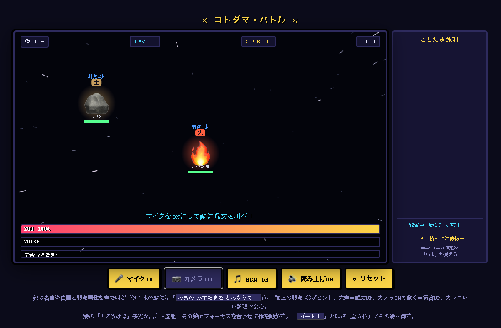

# コトダマ・バトル — 声で殴るAIアーケード

DGX Spark ハッカソン作品。画面に湧くドット絵の敵に **声で弱点属性を叫ぶ**と、
ブラウザのSTTが文字化 → **ローカルLLM（DGX Spark / GB10 の gpt-oss:20b）** が
呪文の属性・威力・対象・カッコよさを判定 → 敵に属性ダメージ。
Webカメラで **顔を照準**にし、**体を動かして** 気合・パンチ・回避もできる。



```text
ブラウザ (Chrome/Edge, WebGPU)                  LLM サーバ (ollama / OpenAI互換)
────────────────────────────                   ───────────────────────────
🎤 マイク
  ├─ RMS音量 ─┐
🎥 カメラ      ├─▶ 即時ティア(遅延0): 気合メーター / パンチ / 回避 / 画面キック
  ├─ 動き量 ──┘
  ├─ 顔の位置 ──▶ 照準スコープ(ロックオン=ターゲット)
  └─ 16kHz PCM ─WS─▶ faster-whisper(STT) ─▶ 叫びテキスト
                                                  │ 敵リスト+音量+照準
                  ───────────HTTP──────────────▶ judgeSpell (gpt-oss:20b)
        {spell_name, element, power, style, target_id, narration} ◀──┘
                                                  │
   遅いティア(~5s): 属性エフェクト/ダメージ/吹っ飛び + Irodori-TTS(WebGPU)読み上げ
```

**二段ティア設計が肝**：音量・動き・顔は遅延ゼロで即反応、STT→LLMは数秒かけて意味判定。
そのラグは右の「ことだまタイムライン」で *いまここ→判定中→結果* と可視化し、演出に変える。
LLMが落ちても `spell-judge.js` の fallback が場を止めない（沈黙が一番怖い）。

## 主な機能

- **声で弱点を突く**：敵は **火・水・氷・土** の4属性。弱点は常識ベース（火←水で消火、氷←火で溶かす、水←雷で感電、土←水で流す）。各敵の頭上に **弱点→◯** を表示するので、それを叫ぶだけ。
- **カッコいい詠唱ほど高ダメージ**：LLMが `style`(1〜100) で採点し倍率に反映（最大×1.9、85以上で「キマった！」）。
- **Webカメラ（任意）**：自分の映像をAR背景に。**肌色重心で顔を追う照準スコープ**でロックオン＝ターゲット。**動き量＝気合ブースト**、**動きスパイク＝パンチ**（物理ヒット）。
- **攻撃を避ける**：敵の **「！こうげき」予兆**（チャージ3秒）に対し ①その敵にフォーカスして体を動かす＝回避 ②「ガード！」と叫ぶ＝全方位ブロック ③予兆中に倒す＝中断。
- **大声クリティカル**（声量大で×1.5）、**コンボ**（連続撃破でスコア倍）。
- **緊張と緩和**：Wave1は練習（敵は攻撃しない）→ 通常 →(4の倍数)休息 →(5の倍数)ミニボス。
- **セッション**：開始 5-4-3-2-1 カウントダウン → **120秒**バトル → 終了画面に **Top10 ランキング**（localStorage保存）。**↻ リセット**で再戦。ダウンで **スコア -500**。
- **疾走する宇宙背景**、**チップチューンBGM**（ボスで激しく）、**読み上げ**（Irodori-TTS / WebGPU、ゼロショット音声クローン）。
- **隠し**：`パルプンテ` と唱えると何かが起きる。

## 構成

| 機能 | 実体 | 備考 |
| --- | --- | --- |
| ホストサーバ | `server/` (FastAPI) | `/`→`/game` リダイレクト、`/ws`(STT)・`/tts/*`(TTSモデル)・`/game` を同一オリジン配信 |
| STT | faster-whisper + Silero VAD | `/ws` にブラウザから16kHz PCMをストリーム |
| TTS | Irodori-TTS WebGPU | 兄弟チェックアウト `../irodori-tts-webgpu` のモデルを配信、`static/tts.mjs` で再生 |
| LLM判定 | `web/spell-judge.js` | ollama `/api/chat` / OpenAI互換 `/v1/chat/completions` を自動判別、judge/enemy を別サーバに分離可 |
| ゲーム本体 | `web/game.html` | Canvas描画・二段ティア・エフェクト・セッション管理（単一ファイル） |

## 起動

```bash
# 依存は uv が自動解決。リポジトリ直下で:
uv run kotodama-battle
# → http://127.0.0.1:8000/ を Chrome/Edge で開く（/game へリダイレクト）
```

最初に表示される **「▶ タップしてスタート」** を押すと、マイク・カメラ・BGM・読み上げを
まとめてONにしてゲーム開始（権限プロンプトと自動再生制限を1タップで解決）。

環境変数（すべて任意）:

| 変数 | 既定 | 説明 |
| --- | --- | --- |
| `STT_MODEL` | `small` | `tiny`/`small`/`large-v3-turbo`/`kotoba-tech/kotoba-whisper-v2.0-faster`（日本語精度↑） |
| `STT_DEVICE` / `STT_COMPUTE_TYPE` | `auto` / `int8` | faster-whisper の実行設定 |
| `STT_PORT` | `8000` | バインドポート |
| `STT_TTS_DIR` | `../irodori-tts-webgpu` | 読み上げ用 Irodori-TTS のチェックアウト（無くてもゲームは動く） |
| `STT_GAME_DIR` | `./web` | ゲーム配信ディレクトリ |

要件: WebGPU対応ブラウザ（Chrome/Edge）、マイク（必須）/カメラ（任意）許可、
**ヘッドホン推奨**（TTS音声をマイクが再認識するのを防ぐ）。

## LLM 設定

既定: judge / enemy ともに `http://gx10-a9c0.local:11434/api/chat` の `gpt-oss:20b`。
**自分の環境では URL クエリで上書き**してください（到達不能だと fallback 判定で動作）:

```text
# judge(呪文判定)とenemy(敵攻撃生成)を分散も可
/game/?judge=http://<host-a>:11434/api/chat&enemy=http://<host-b>:11434/api/chat&model=gpt-oss:20b
# OpenAI互換(vLLM/deepseek系など)も自動判別
/game/?judge=http://<host>:8000/v1/chat/completions&judgeModel=deepseek-v4-flash
```

実測メモ(gpt-oss:20b): DGX Spark GB10 で warm ~5s。`gemma4:31b` は ~59s で実用外。

会場での注意:

- **CORS**: ブラウザから別オリジンの ollama を叩くため、サーバ側で `OLLAMA_ORIGINS=*` を設定して `ollama serve`。
- ollama 落ち / STT外れ でも fallback で場が止まらない。

## ファイル

- `web/game.html` — ゲーム本体（描画・入力・セッション・全演出）
- `web/spell-judge.js` — LLM判定（属性・威力・style・ターゲティング・敵攻撃生成・robust fallback、2エンドポイント対応）
- `web/ref-kyoko.wav` — 読み上げのクローン元参照音声
- `server/` — FastAPI ホスト（STT WebSocket・TTSモデル配信・ゲーム配信）
- `static/{tts.mjs,worklet.js}` — TTS再生 / マイク取り込み worklet
- `tests/test_session.py` — VAD/セグメントバッファのテスト

## 既存資産

- STT は faster-whisper、読み上げは [irodori-tts-webgpu](https://github.com/ngc-shj/irodori-tts-webgpu)（ブラウザWebGPUでゼロショット音声クローン）を利用。

## 参考・関連リンク

DGX Spark ハッカソン / AIゲームセンター構想まわり:

note（清水亮 / shi3z）:

- [AIゲームセンター構想 500%突破を記念して、DGX Sparkハッカソンを6/13(6/14は間違いです)開催。オンライン中継もするよ!残り15日!](https://note.com/shi3zblog/n/n132bc844a348)
- [シリコンバレーvs秋葉原!栄冠は誰の手に!?第一回DGX Sparkハッカソン開催!](https://note.com/shi3zblog/n/nd8bd62f07a61)

YouTube:

- [ハッカー魂 第一回DGX Sparkハッカソン開始!ブリーフィング](https://www.youtube.com/watch?v=sAYJgcP0Rps)
- [【緊急参戦】日本初のDGX Sparkハッカソンに参加してみました！ ep3152](https://www.youtube.com/watch?v=lr-Y05H1ibA)
